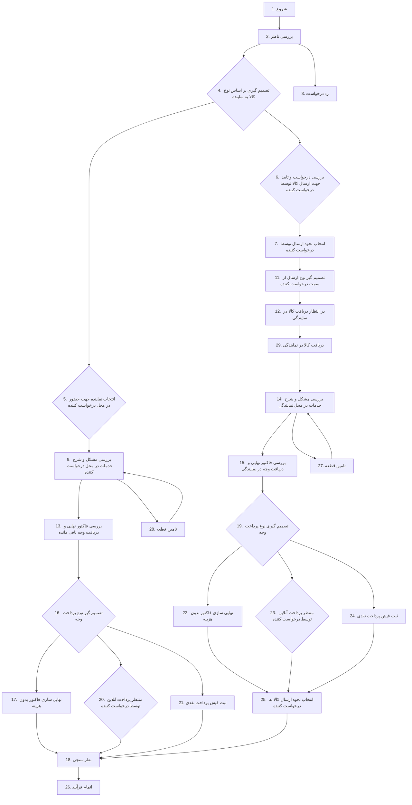

# BPMN Flow for Ariakish Customer

This document provides a complete and detailed outline of the BPMN flow for the "ariakish" customer, based on the data extracted from the BPMN tables in the database and the provided source code.

## 1. BPMN Process Overview

The main process for the guarantee is:

- **ID**: 1
- **Name**: فرآیند اصلی گارانتی (Main Guarantee Process)
- **Is Sub-Process**: No
- **Static ID**: 1

## 2. BPMN Graph

## 3. Traversal Logic

The `TraverseService` in `apps/bpmn/src/modules/traverse/traverse.service.ts` is the core component that drives the BPMN flow. When a user interacts with the system through a controller (e.g., `PickOrganizationController`), the controller calls a service that, in turn, calls the `TraverseService`.

The `TraverseService` performs the following steps:

1.  **Get the current request state**: It finds the current activity for the given request from the `BPMNRequestStates` table.
2.  **Find the relevant node**: Based on the current activity and the user's command, it finds the corresponding `BPMNNode`. Each command in a node is associated with a specific transition to a new activity.
3.  **Check conditions**: If the node has any conditions defined in `BPMNNodeConditions`, the `TraverseService` calls the `ConditionModule`. This module dynamically instantiates and executes the `check` method of the corresponding condition service from `apps/bpmn/src/dynamic-condition/guarantee/**`. For example, if a node has a condition with `conditionSource` set to `MandatoryAttendanceService`, the `MandatoryAttendanceService.check()` method is called. If the condition returns `false`, the transition is halted.
4.  **Execute actions**:
    -   **Outbound Actions**: Before leaving the current activity, the `TraverseService` checks for any outbound actions defined in `BPMNOutboundActions`. If any exist, it calls the `ActionModule` to execute them.
    -   **Inbound Actions**: After transitioning to the new activity, the `TraverseService` checks for any inbound actions defined in `BPMNInboundActions`. If any exist, the `ActionModule` is called to execute them.
    The `ActionModule` dynamically instantiates and executes the `executeAction` method of the corresponding action service from `apps/bpmn/src/dynamic-action/guarantee/**`. For example, if an action's `actionSource` is `NotificationSenderForNewIncomingCartableRequestActionService`, the `executeAction` method of that service is called.
5.  **Update request state**: The `TraverseService` updates the `BPMNRequestStates` table to reflect the new current activity for the request.
6.  **Log history**: A new entry is created in the `BPMNRequestHistory` table to log the transition, including the user who performed the action, the command, and the from/to activities.

## 4. Detailed Node Information

---

### **Node 1: Start**
- **From Activity**: 1 (شروع)
- **To Activity**: 2 (بررسی ناظر)
- **Command**: `ارجاع به ناظر` (Refer to Supervisor)

---

### **Node 2: Supervisor Review**
- **From Activity**: 2 (بررسی ناظر)

#### **Transition 1: To Activity 4 (تصمیم گیری بر اساس نوع کالا به نماینده)**
- **Command**: `ارسال به نماینده` (Send to Representative)
- **Inject Form**: `PickOrganization`
- **Route**: `/api/guarantee/cartable/pickOrganizations`
- **Controller**: `apps/guarantee/src/cartable/pick-organization/pick-organization.controller.ts` -> `traverse` method
- **Service**: `apps/guarantee/src/cartable/pick-organization/pick-organization.service.ts`
  - **Description**: This service validates the cartable item, assigns an organization to the request, and then traverses the BPMN flow.

#### **Transition 2: To Activity 3 (رد درخواست)**
- **Command**: `رد درخواست` (Reject Request)
- **Inject Form**: `DescriptionForm`
- **Route**: `/api/guarantee/cartable/reject`
- **Controller**: `apps/guarantee/src/cartable/reject/reject.controller.ts`
- **Service**: `apps/guarantee/src/cartable/reject/reject.service.ts`
  - **Description**: This service validates the cartable item and then traverses the BPMN flow to reject the request.

---

### **Node 4: Decision based on product type**
- **From Activity**: 4 (تصمیم گیری بر اساس نوع کالا به نماینده)
- **Outbound Actions**:
  - **Action**: `UpdateRequestMandatoryAttendanceActionService`
    - **Code**: `apps/bpmn/src/dynamic-action/guarantee/update-request-mandatory-attendance-action/update-request-mandatory-attendance-action.service.ts`
    - **Description**: This action updates the `mandatoryAttendance` flag on the request. It sets the flag to `true` if the product type requires mandatory attendance or if the request is an installation request.

#### **Transition 1: To Activity 5 (انتخاب نماینده جهت حضور در محل درخواست کننده)**
- **Condition**: `نماینده به صورت حضوری به محل سر میزند؟` (Does the representative visit the location in person?)
  - **Condition Source**: `MandatoryAttendanceService`
  - **Code**: `apps/bpmn/src/dynamic-condition/guarantee/mandatory-attendance/mandatory-attendance.service.ts`
  - **Description**: This condition checks if the product type requires mandatory attendance or if the request is an installation request.
- **Command**: `تایید` (Confirm)

#### **Transition 2: To Activity 6 (بررسی درخواست و تایید جهت ارسال کالا توسط درخواست کننده)**
- **Condition**: `درخواست کننده میبایست کالا را به نماینده ارسال نماید؟` (Should the requester send the product to the representative?)
  - **Condition Source**: `NonMandatoryAttendanceService`
  - **Code**: `apps/bpmn/src/dynamic-condition/guarantee/non-mandatory-attendance/non-mandatory-attendance.service.ts`
  - **Description**: This condition checks if the product type does not require mandatory attendance and the request is not an installation request.
- **Command**: `تایید` (Confirm)

---

### **Node 5: Select representative for on-site visit**
- **From Activity**: 5 (انتخاب نماینده جهت حضور در محل درخواست کننده)
- **To Activity**: 9 (بررسی مشکل و شرح خدمات در محل درخواست کننده)
- **Command**: `انتخاب نماینده جهت حضور در محل`
- **Route**: `/v1/api/guarantee/cartable/pickTechnicalUser`
- **Controller**: `apps/guarantee/src/cartable/pick-technical-user/pick-technical-user.controller.ts`
- **Service**: `apps/guarantee/src/cartable/pick-technical-user/pick-technical-user.service.ts`
    - **Description**: This service assigns a technical user to the request, along with the visit date and time, and then traverses the BPMN flow.
- **Inbound Actions**:
    - **Action**: `NewRequestIncomingIntoCartable`
        - **Action Source**: `NotificationSenderForNewIncomingCartableRequestActionService`
        - **Code**: `apps/bpmn/src/dynamic-action/guarantee/notification-sender-for-new-incoming-cartable-request-action/notification-sender-for-new-incoming-cartable-request-action.service.ts`
        - **Description**: This action sends an SMS notification to the users of the new cartable item.

---

### **Node 6: Review request and confirm for customer to send product**
- **From Activity**: 6 (بررسی درخواست و تایید جهت ارسال کالا توسط درخواست کننده)
- **To Activity**: 7 (انتخاب نحوه ارسال توسط درخواست کننده)
- **Command**: `تایید و درخواست ارسال کالا توسط درخواست کننده`
- **Route**: `/v1/api/guarantee/cartable/confirm`
- **Controller**: `apps/guarantee/src/cartable/confirm/confirm.controller.ts`
- **Service**: `apps/guarantee/src/cartable/confirm/confirm.service.ts`
    - **Description**: This service confirms the request and traverses the BPMN flow.

---

### **Node 7: Choose how to send by the requester**
- **From Activity**: 7 (انتخاب نحوه ارسال توسط درخواست کننده)
- **To Activity**: 11 (تصمیم گیر نوع ارسال از سمت درخواست کننده)
- **Command**: `تایید و ثبت مشخصات ارسال برای نماینده`
- **Route**: `/v1/api/guarantee/client/pickShipmentway`
- **Controller**: `apps/guarantee/src/client/pick-shipment-way/pick-shipmentway.controller.ts`
- **Service**: `apps/guarantee/src/client/pick-shipment-way/pick-shipmentway.service.ts`
    - **Description**: This service sets the client's chosen shipment way and tracking code for the request and then traverses the BPMN flow.
- **Inbound Actions**:
    - **Action**: `NewRequestForClientShippingWay`
        - **Action Source**: `NotificationSenderForClientShippingWayRequestActionService`
        - **Code**: `apps/bpmn/src/dynamic-action/guarantee/notification-sender-for-client-shipping-way-request-action/notification-sender-for-client-shipping-way-request-action.service.ts`
        - **Description**: This action sends an SMS notification to the client regarding the chosen shipping method.

---

### **Node 8: Decide how to send from the requester's side**
- **From Activity**: 11 (تصمیم گیر نوع ارسال از سمت درخواست کننده)
- **To Activity**: 12 (در انتظار دریافت کالا در نمایندگی)
- **Command**: `تایید` (Confirm)

---

### **Node 9: Check the problem and description of services at the requester's location**
- **From Activity**: 9 (بررسی مشکل و شرح خدمات در محل درخواست کننده)
- **To Activity**: 13 (بررسی فاکتور نهایی و دریافت وجه باقی مانده)
- **Command**: `تایید شرح خدمات جهت ثبت فاکتور`
- **Route**: `/v1/api/guarantee/cartable/submitSolutionItemInRequestLocation`
- **Controller**: `apps/guarantee/src/cartable/submit-solution-item-in-request-location/submit-solution-item-in-request-location.controller.ts`
- **Service**: `apps/guarantee/src/cartable/submit-solution-item-in-request-location/submit-solution-item-in-request-location.service.ts`
  - **Description**: This service creates a factor and local transactions based on the provided solution items and then traverses the BPMN flow.

---

### **Node 10: Waiting to receive the product at the agency**
- **From Activity**: 12 (در انتظار دریافت کالا در نمایندگی)
- **To Activity**: 29 (دریافت کالا در نمایندگی)
- **Command**: `تایید دریافت کالا` (Confirm receipt of goods)
- **Route**: `/v1/api/guarantee/cartable/confirmReceiveDeviceInOrganization`
- **Controller**: `apps/guarantee/src/cartable/confirm-receive-device-in-organization/confirm-receive-device-in-organization.controller.ts`
- **Service**: `apps/guarantee/src/cartable/confirm-receive-device-in-organization/confirm-receive-device-in-organization.service.ts`
  - **Description**: This service creates request items based on the received goods and then traverses the BPMN flow.
- **Inbound Actions**:
    - **Action**: `NotificationSenderForClientReceivingDeviceActionService`
      - **Code**: `apps/bpmn/src/dynamic-action/guarantee/notification-sender-for-client-receiving-device-action/notification-sender-for-client-receiving-device-action.service.ts`
      - **Description**: This action sends an SMS notification to the client upon receiving the device at the organization.

---

### **Node 11: Check the problem and description of services at the agency**
- **From Activity**: 14 (بررسی مشکل و شرح خدمات در محل نمایندگی)
- **To Activity**: 15 (بررسی فاکتور نهایی و دریافت وجه در نمایندگی)
- **Command**: `تایید شرح خدمات جهت ثبت فاکتور` (Confirm service description for invoice registration)
- **Route**: `/v1/api/guarantee/cartable/submitSolutionItem`
- **Controller**: `apps/guarantee/src/cartable/submit-solution-item/submit-solution-item.controller.ts`
- **Service**: `apps/guarantee/src/cartable/submit-solution-item/submit-solution-item.service.ts`
  - **Description**: This service creates a factor and local transactions based on the provided solution items and then traverses the BPMN flow.

---

### **Node 12: Final invoice review and payment at the agency**
- **From Activity**: 15 (بررسی فاکتور نهایی و دریافت وجه در نمایندگی)
- **To Activity**: 19 (تصمیم گیری نوع پرداخت وجه)
- **Command**: `تایید و دریافت وجه` (Confirm and receive payment)
- **Route**: `/v1/api/guarantee/cartable/submitFactor`
- **Controller**: `apps/guarantee/src/cartable/submit-factor/submit-factor.controller.ts`
- **Service**: `apps/guarantee/src/cartable/submit-factor/submit-factor.service.ts`
  - **Description**: This service updates the `isCash` status of the request, creates request attachments, and then traverses the BPMN flow.

---

### **Node 13: Final invoice review and receipt of remaining amount**
- **From Activity**: 13 (بررسی فاکتور نهایی و دریافت وجه باقی مانده)
- **To Activity**: 16 (تصمیم گیر نوع پرداخت وجه)
- **Command**: `تایید و دریافت وجه` (Confirm and receive payment)
- **Route**: `/v1/api/guarantee/cartable/submitFactorInRequestLocation`
- **Controller**: `apps/guarantee/src/cartable/submit-factor-in-request-location/submit-factor-in-request-location.controller.ts`
- **Service**: `apps/guarantee/src/cartable/submit-factor-in-request-location/submit-factor-in-request-location.service.ts`
  - **Description**: This service updates the `isCash` status of the request, creates request attachments, and then traverses the BPMN flow.

---

### **Node 14: Finalize the invoice at no cost**
- **From Activity**: 16 (تصمیم گیر نوع پرداخت وجه)
- **To Activity**: 17 (نهایی سازی فاکتور بدون هزینه)
- **Condition**: `مبلغ باقی مانده پرداخت صفر است؟` (Is the remaining payment amount zero?)
  - **Condition Source**: `IsNoPaymentService`
  - **Code**: `apps/bpmn/src/dynamic-condition/guarantee/is-no-payment/is-no-payment.service.ts`
  - **Description**: This condition checks if the remaining amount to be paid for the factor is zero.
- **Command**: `تایید` (Confirm)

---

### **Node 15: Finalize the invoice at no cost**
- **From Activity**: 17 (نهایی سازی فاکتور بدون هزینه)
- **To Activity**: 18 (نظر سنجی)
- **Command**: `تایید` (Confirm)
- **Inbound Actions**:
    - **Action**: `UpdateRequestFactorToSucess`
      - **Action Source**: `UpdateRequestFactorToSucessActionService`
      - **Code**: `apps/bpmn/src/dynamic-action/guarantee/update-request-factor-to-success-action/update-request-factor-to-sucess-action.service.ts`
      - **Description**: This action updates the factor status to "Paid" and calculates various financial breakdowns related to the warranty and payment.

---

### **Node 16: Decide on the type of payment**
- **From Activity**: 15 (بررسی فاکتور نهایی و دریافت وجه در نمایندگی)
- **To Activity**: 19 (تصمیم گیری نوع پرداخت وجه)
- **Command**: `تایید و دریافت وجه` (Confirm and receive payment)
- **Route**: `/v1/api/guarantee/cartable/submitFactor`
- **Controller**: `apps/guarantee/src/cartable/submit-factor/submit-factor.controller.ts`
- **Service**: `apps/guarantee/src/cartable/submit-factor/submit-factor.service.ts`
  - **Description**: This service updates the `isCash` status of the request, creates request attachments, and then traverses the BPMN flow.

---

### **Node 17: Wait for online payment by the requester**
- **From Activity**: 16 (تصمیم گیر نوع پرداخت وجه)
- **To Activity**: 20 (منتظر پرداخت آنلاین توسط درخواست کننده)
- **Condition**: `پرداخت به صورت آنلاین میباشد؟` (Is the payment online?)
  - **Condition Source**: `IsOnlinePaymentService`
  - **Code**: `apps/bpmn/src/dynamic-condition/guarantee/is-online-payment/is-online-payment.service.ts`
  - **Description**: This condition checks if the remaining amount to be paid for the factor is greater than zero and if the payment is not cash (i.e., online).
- **Command**: `تایید` (Confirm)
- **Inbound Actions**:
  - **Action**: `NotificationSenderForClientOnlinePaymentRequestActionService`
    - **Code**: `apps/bpmn/src/dynamic-action/guarantee/notification-sender-for-client-online-payment-request-action/notification-sender-for-client-online-payment-request-action.service.ts`
    - **Description**: This action sends an SMS notification to the client for online payment.

---

### **Node 18: Register the cash payment receipt**
- **From Activity**: 16 (تصمیم گیر نوع پرداخت وجه)
- **To Activity**: 21 (ثبت فیش پرداخت نقدی)
- **Condition**: `پرداخت به صورت نقدی میباشد؟` (Is the payment cash?)
  - **Condition Source**: `IsCashPaymentService`
  - **Code**: `apps/bpmn/src/dynamic-condition/guarantee/is-cash-payment/is-cash-payment.service.ts`
  - **Description**: This condition checks if the remaining amount to be paid for the factor is greater than zero and if the payment is cash.
- **Command**: `تایید` (Confirm)

---

### **Node 19: Submit survey**
- **From Activity**: 18 (نظر سنجی)
- **To Activity**: 26 (اتمام فرآیند)
- **Command**: `ثبت` (Submit)
- **Route**: `/v1/api/guarantee/client/submitSurvey`
- **Controller**: `apps/guarantee/src/client/submit-survey/submit-survey.controller.ts`
- **Service**: `apps/guarantee/src/client/submit-survey/submit-survey.service.ts`
  - **Description**: This service handles the submission of a survey, calculates scores, and then traverses the BPMN flow.
- **Inbound Actions**:
  - **Action**: `PointInSurveyRequestActionService`
    - **Code**: `apps/bpmn/src/dynamic-action/guarantee/point-in-survey-action/point-in-survey-request-action.service.ts`
    - **Description**: This action awards points to the user for completing the survey.

---

### **Node 20: Finalize the invoice at no cost**
- **From Activity**: 19 (تصمیم گیری نوع پرداخت وجه)
- **To Activity**: 22 (نهایی سازی فاکتور بدون هزینه)
- **Command**: `تایید` (Confirm)

---

### **Node 21: Wait for online payment by the requester**
- **From Activity**: 19 (تصمیم گیری نوع پرداخت وجه)
- **To Activity**: 23 (منتظر پرداخت آنلاین توسط درخواست کننده)
- **Command**: `تایید` (Confirm)

---

### **Node 22: Register the cash payment receipt**
- **From Activity**: 19 (تصمیم گیری نوع پرداخت وجه)
- **To Activity**: 24 (ثبت فیش پرداخت نقدی)
- **Command**: `تایید` (Confirm)

---

### **Node 23: Choose how to send the product to the requester**
- **From Activity**: 22 (نهایی سازی فاکتور بدون هزینه)
- **To Activity**: 25 (انتخاب نحوه ارسال کالا به درخواست کننده)
- **Command**: `تایید` (Confirm)

---

### **Node 24: Choose how to send the product to the requester**
- **From Activity**: 24 (ثبت فیش پرداخت نقدی)
- **To Activity**: 25 (انتخاب نحوه ارسال کالا به درخواست کننده)
- **Command**: `تایید` (Confirm)

---

### **Node 25: Choose how to send the product to the requester**
- **From Activity**: 20 (منتظر پرداخت آنلاین توسط درخواست کننده)
- **To Activity**: 18 (نظر سنجی)
- **Command**: `تایید` (Confirm)

---

### **Node 26: Choose how to send the product to the requester**
- **From Activity**: 23 (منتظر پرداخت آنلاین توسط درخواست کننده)
- **To Activity**: 25 (انتخاب نحوه ارسال کالا به درخواست کننده)
- **Command**: `تایید` (Confirm)

---

### **Node 27: Choose how to send the product to the requester**
- **From Activity**: 25 (انتخاب نحوه ارسال کالا به درخواست کننده)
- **To Activity**: 18 (نظر سنجی)
- **Command**: `تایید و ارسال به مشتری` (Confirm and send to customer)
- **Route**: `/v1/api/guarantee/cartable/pickShipmentway`
- **Controller**: `apps/guarantee/src/cartable/pick-shipment-way/pick-shipmentway.controller.ts` (assumed)
- **Service**: `apps/guarantee/src/cartable/pick-shipment-way/pick-shipmentway.service.ts`
  - **Description**: This service sets the client's chosen shipment way and tracking code for the request and then traverses the BPMN flow.

---

### **Node 28: End Process**
- **From Activity**: 26 (اتمام فرآیند)
- **To Activity**: End of process

---

### **Node 29: Supply Part**
- **From Activity**: 14 (بررسی مشکل و شرح خدمات در محل نمایندگی)
- **To Activity**: 27 (تامین قطعه)
- **Command**: `ارسال به تامین قطعه` (Send to part supply)
- **Route**: `/v1/api/guarantee/cartable/confirm`
- **Controller**: `apps/guarantee/src/cartable/confirm/confirm.controller.ts`
- **Service**: `apps/guarantee/src/cartable/confirm/confirm.service.ts`
  - **Description**: This service confirms the request and traverses the BPMN flow.

---

### **Node 30: Supply Part - Add Note**
- **From Activity**: 27 (تامین قطعه)
- **To Activity**: 27 (تامین قطعه)
- **Command**: `ثبت یادداشت` (Add note)
- **Route**: `/v1/api/guarantee/cartable/confirmSupplier`
- **Controller**: `apps/guarantee/src/cartable/confirm-supplier/confirm-supplier.controller.ts` (assumed)
- **Service**: `apps/guarantee/src/cartable/confirm-supplier/confirm-supplier.service.ts` (assumed)
  - **Description**: This service is likely used to confirm a supplier or add notes related to supplier actions, then traverses the BPMN flow.

---

### **Node 31: Supply Part - Revert to Technical User**
- **From Activity**: 27 (تامین قطعه)
- **To Activity**: 14 (بررسی مشکل و شرح خدمات در محل نمایندگی)
- **Command**: `بازگشت به تکنسین` (Revert to technician)
- **Route**: `/v1/api/guarantee/cartable/revertToTechnicalUser`
- **Controller**: `apps/guarantee/src/cartable/revert-to-technical-user/revert-to-technical-user.controller.ts` (assumed)
- **Service**: `apps/guarantee/src/cartable/revert-to-technical-user/revert-to-technical-user.service.ts` (assumed)
  - **Description**: This service reverts the request back to the technical user for further action.

---

### **Node 32: Supply Part**
- **From Activity**: 9 (بررسی مشکل و شرح خدمات در محل درخواست کننده)
- **To Activity**: 28 (تامین قطعه)
- **Command**: `ارسال به تامین قطعه` (Send to part supply)
- **Route**: `/v1/api/guarantee/cartable/confirm`
- **Controller**: `apps/guarantee/src/cartable/confirm/confirm.controller.ts`
- **Service**: `apps/guarantee/src/cartable/confirm/confirm.service.ts`
  - **Description**: This service confirms the request and traverses the BPMN flow.

---

### **Node 33: Supply Part - Add Note**
- **From Activity**: 28 (تامین قطعه)
- **To Activity**: 28 (تامین قطعه)
- **Command**: `ثبت یادداشت` (Add note)
- **Route**: `/v1/api/guarantee/cartable/confirmSupplier`
- **Controller**: `apps/guarantee/src/cartable/confirm-supplier/confirm-supplier.controller.ts` (assumed)
- **Service**: `apps/guarantee/src/cartable/confirm-supplier/confirm-supplier.service.ts` (assumed)
  - **Description**: This service is likely used to confirm a supplier or add notes related to supplier actions, then traverses the BPMN flow.

---

### **Node 34: Supply Part - Revert to Technical User**
- **From Activity**: 28 (تامین قطعه)
- **To Activity**: 9 (بررسی مشکل و شرح خدمات در محل درخواست کننده)
- **Command**: `بازگشت به تکنسین` (Revert to technician)
- **Route**: `/v1/api/guarantee/cartable/revertToTechnicalUser`
- **Controller**: `apps/guarantee/src/cartable/revert-to-technical-user/revert-to-technical-user.controller.ts` (assumed)
- **Service**: `apps/guarantee/src/cartable/revert-to-technical-user/revert-to-technical-user.service.ts` (assumed)
  - **Description**: This service reverts the request back to the technical user for further action.

---

### **Node 35: Revert to previous stage**
- **From Activity**: 15 (بررسی فاکتور نهایی و دریافت وجه در نمایندگی)
- **To Activity**: 14 (بررسی مشکل و شرح خدمات در محل نمایندگی)
- **Command**: `بازگشت به مرحله قبل` (Revert to previous stage)
- **Route**: `/v1/api/guarantee/cartable/revertToTechnicalUser`
- **Controller**: `apps/guarantee/src/cartable/revert-to-technical-user/revert-to-technical-user.controller.ts` (assumed)
- **Service**: `apps/guarantee/src/cartable/revert-to-technical-user/revert-to-technical-user.service.ts` (assumed)
  - **Description**: This service reverts the request back to the technical user for further action.

---

### **Node 36: Revert to previous stage**
- **From Activity**: 13 (بررسی فاکتور نهایی و دریافت وجه باقی مانده)
- **To Activity**: 9 (بررسی مشکل و شرح خدمات در محل درخواست کننده)
- **Command**: `بازگشت به مرحله قبل` (Revert to previous stage)
- **Route**: `/v1/api/guarantee/cartable/revertToTechnicalUser`
- **Controller**: `apps/guarantee/src/cartable/revert-to-technical-user/revert-to-technical-user.controller.ts` (assumed)
- **Service**: `apps/guarantee/src/cartable/revert-to-technical-user/revert-to-technical-user.service.ts` (assumed)
  - **Description**: This service reverts the request back to the technical user for further action.

---

### **Node 37: Refer to technician**
- **From Activity**: 29 (دریافت کالا در نمایندگی)
- **To Activity**: 14 (بررسی مشکل و شرح خدمات در محل نمایندگی)
- **Command**: `ارجاع به تکنسین` (Refer to technician)
- **Route**: `/v1/api/guarantee/cartable/pickTechnicalUserInOrganization`
- **Controller**: `apps/guarantee/src/cartable/pick-technical-user-in-organization/pick-technical-user-in-organization.controller.ts` (assumed)
- **Service**: `apps/guarantee/src/cartable/pick-technical-user-in-organization/pick-technical-user-in-organization.service.ts` (assumed)
  - **Description**: This service assigns a technical user within the organization to the request and then traverses the BPMN flow.

---

This is the complete documentation of the BPMN flow.